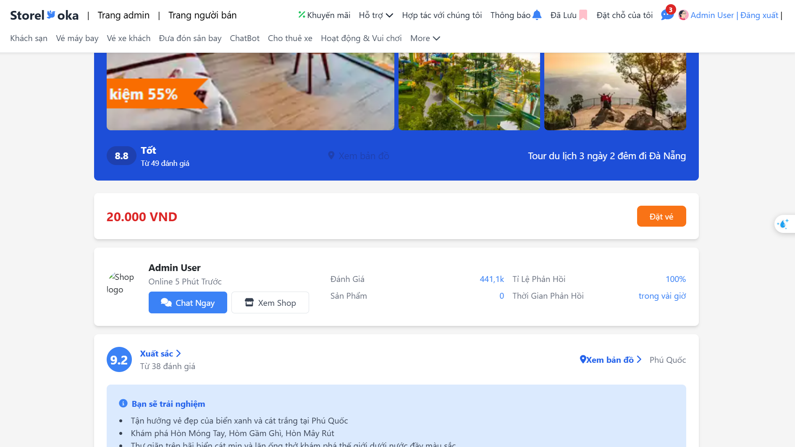
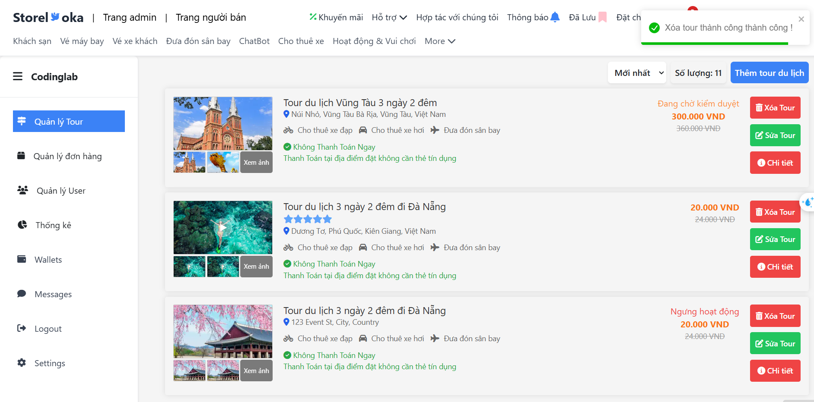

# TourTravelStore_FE

## Description

This is a tour management project that provides a client-side response. The project includes features such as:

- Register as a buyer or seller
- Real-time chat
- Notifications
- Payment through various gateways like Momo, ZaloPay, etc.
- Search functionality
- AI-powered chatbot (Artificial Intelligence)
- User management
- Tour management
- Order management
- Reviews and comments
- Wishlist functionality
- Google Maps, Leaflet maps, and Font Awesome icons for an attractive user interface.

---

## SPACE FOR USERS / CUSTOMERS

### Home Page


### Favourites

- Click to like
  

- Space to save favourite products
  

### Search Page


### Product Detail Page


### Shop Detail Page



### Google Map Integration


### Chat with AI


### Comment on Product

- Comment Form
  

- Comment Success
  

- List of Comments
  

- Update Comment
  

### Real-Time Chat with Vendor


### Booking Page


### Verify Page


### Payment Page


### Payment with Momo

- Payment Gateway with Momo
  

- Verify OTP
  

- Momo Payment Success
  

### Payment with ZaloPay

- Choose Payment Gateway
  

- Payment Gateway with ZaloPay
  

- ZaloPay Success
  

### Payment Success Page


---

## SPACE FOR VENDORS

### Manage Tours


### Create Tour


### Verify Tour Creation


### Create Tour Success


### Update Tour


### Update Success


### Delete Tour


### Delete Tour Success



---

## Installation

To install the project, follow these steps:

1. **Clone the repository**
   ```bash
   git clone https://github.com/Minhhiep222/TourTravelStore_FE.git
   ```
2. run "npm install"

3. run "npm run serve"
